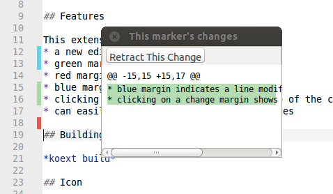

Track unsaved and source-code-control file changes in the editor margin.

Note that source-code-control tracking only works in Komodo IDE.

## Screenshot

## Features

This extension provides features such as:
* a new editor margin for all files
* green margin indicates new lines
* red margin indicates a line deletion
* blue margin indicates a line modification
* clicking on a change margin shows a popup of the changes
* can easily revert (undo) individual changes

## Installing

This add-on is included in Komodo (version 9.0.0 and higher).

## Building from source

*koext build*

## Icon

Track changes icon comes from the Oxygen Icon Set (LGPL):
https://github.com/pasnox/oxygen-icons-png/blob/master/oxygen/32x32/mimetypes/application-vnd.scribus.png
